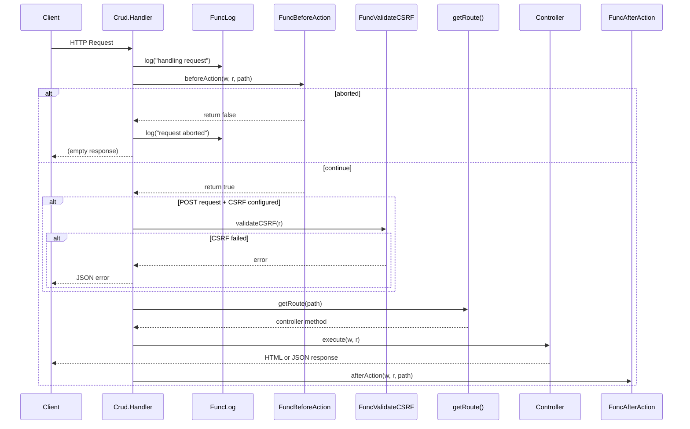
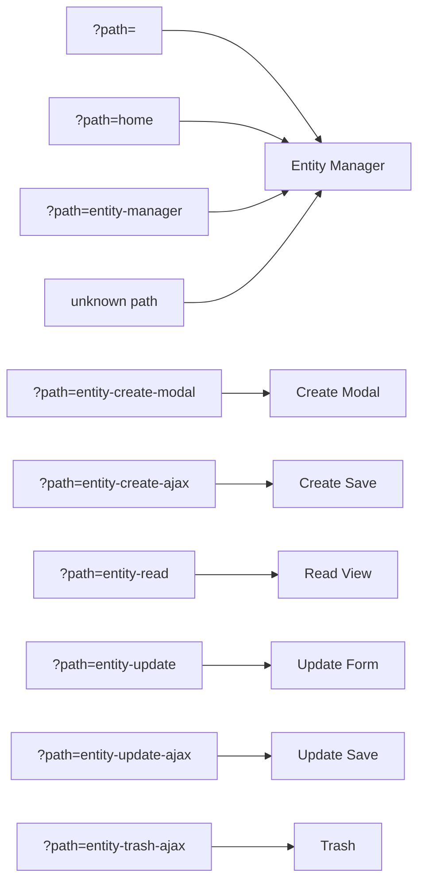
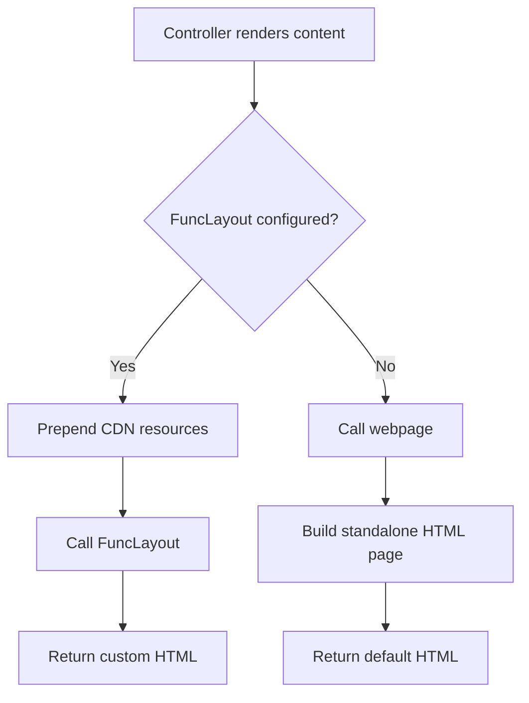
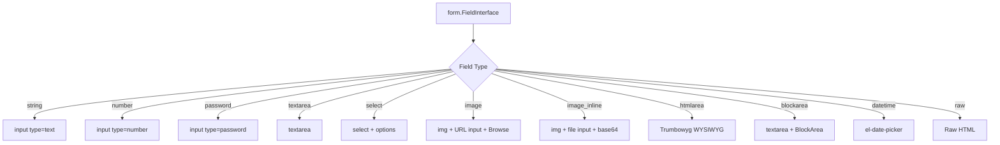

# Architecture

## Design Philosophy

The CRUD package is designed around three core principles:

1. **Callback-driven** - All data access is delegated to user-provided functions, keeping the package database-agnostic
2. **Server-side rendering** - HTML is generated on the server using the `hb` HTML builder, with Vue.js added for interactivity
3. **Convention over configuration** - Sensible defaults with optional overrides for layout, pagination, logging, and security

## Package Structure

```
v2/
├── breadcrumb.go                      # Breadcrumb type definition
├── config.go                          # Config struct (public API)
├── constants.go                       # Route paths and form field type constants
├── crud.go                            # Crud struct, Handler, routing, layout, form rendering, URL helpers
├── crud_test.go                       # Tests for routing, layout, URL helpers, breadcrumbs
├── entity_create_controller.go        # Create modal and AJAX save
├── entity_create_controller_test.go   # Create controller tests
├── entity_manager_controller.go       # Entity listing page with DataTable
├── entity_manager_controller_test.go  # Manager controller tests
├── entity_read_controller.go          # Read-only entity view
├── entity_read_controller_test.go     # Read controller tests
├── entity_trash_controller.go         # Trash (soft-delete) via AJAX
├── entity_trash_controller_test.go    # Trash controller tests
├── entity_update_controller.go        # Update form and AJAX save
├── entity_update_controller_test.go   # Update controller tests
├── key_value.go                       # KeyValue type for read view
├── log.go                             # Log level constants and log helper
├── new.go                             # New() constructor with validation
├── new_test.go                        # Constructor validation tests
├── pagination.go                      # Pagination rendering
├── row.go                             # Row type for entity manager table
├── go.mod                             # Module definition
└── go.sum                             # Dependency checksums
```

## Request Lifecycle



## Routing Architecture

All requests flow through a single `Handler(w, r)` method. The `path` query parameter determines which controller handles the request:



Unknown paths fall back to the entity manager page.

## Controller Pattern

Each controller follows the same internal pattern:

1. A private struct holding a pointer to the parent `Crud` instance
2. A factory method on `Crud` (e.g., `newEntityCreateController()`)
3. One or more handler methods matching `func(w http.ResponseWriter, r *http.Request)`

```go
type entityCreateController struct {
    crud *Crud
}

func (crud *Crud) newEntityCreateController() *entityCreateController {
    return &entityCreateController{crud: crud}
}

func (controller *entityCreateController) modalShow(w http.ResponseWriter, r *http.Request) {
    // ...
}
```

Controllers are **not exported** - they are internal implementation details. The only public entry point is `Crud.Handler`.

## Layout System

The layout system has two modes:



### Custom Layout Mode

When `FuncLayout` is provided, the package prepends required CDN resources (HTMX, Vue.js, Sweetalert2, Element Plus) to the `jsFiles` and `styleFiles` slices before delegating to the custom function. This allows embedding CRUD pages within an existing application shell.

### Default Layout Mode

When `FuncLayout` is `nil`, a standalone HTML page is generated with Bootstrap 5, jQuery, Vue.js, and Sweetalert2 loaded from CDN.

## Form System

Forms are generated server-side using the `form` method on `Crud`. Each field type maps to a specific HTML structure:



All fields (except `raw`) use Vue.js `v-model` binding with the pattern `v-model="entityModel.<fieldName>"`.

## Key Design Decisions

### Single Handler Entry Point

All CRUD operations are served through one `http.HandlerFunc`. This simplifies integration - consumers register a single route and the package handles all sub-routing internally via the `path` query parameter.

### Callback-Driven Data Access

The package never touches a database directly. All data operations are delegated to user-provided callback functions. This makes the package compatible with any storage backend (SQL, NoSQL, APIs, files, etc.).

### Server-Side HTML Generation

HTML is generated on the server using the `hb` (HTML builder) package rather than templates. This provides type safety and composability at the cost of some verbosity.

### Vue.js for Interactivity

Vue.js 3 is used for client-side interactivity (form binding, modal management, AJAX calls). Each page mounts a Vue app on a specific container element.

### HTMX for Create Modal

The create modal is loaded via HTMX (`hx-get`) rather than being embedded in the page. This keeps the initial page load lighter and separates the create form from the entity manager.

## See Also

- [Overview](overview.md) - High-level introduction
- [Data Flow](data_flow.md) - How data moves through the system
- [Modules: Controllers](modules/controllers.md) - Detailed controller documentation
- [Modules: Crud Core](modules/crud_core.md) - Core struct documentation
