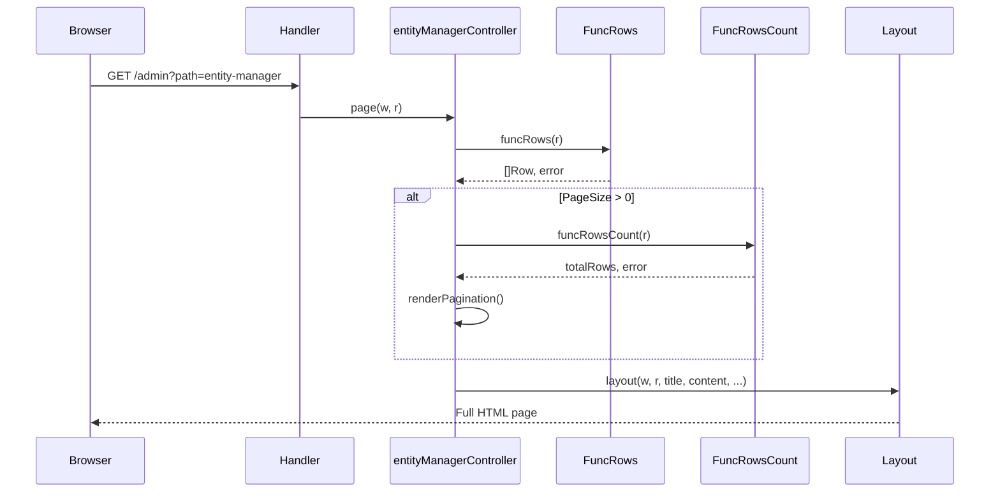
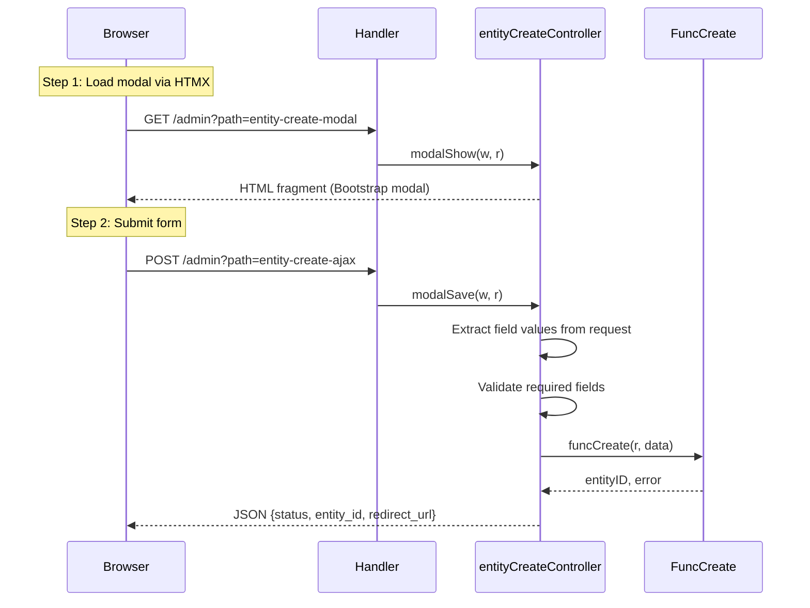
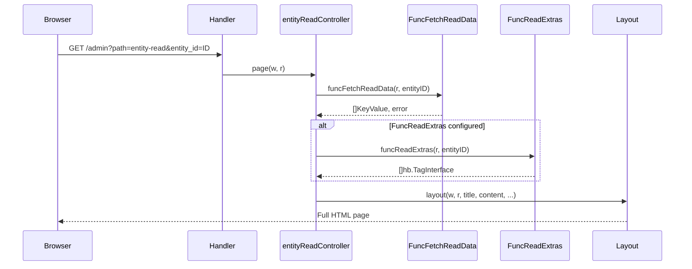
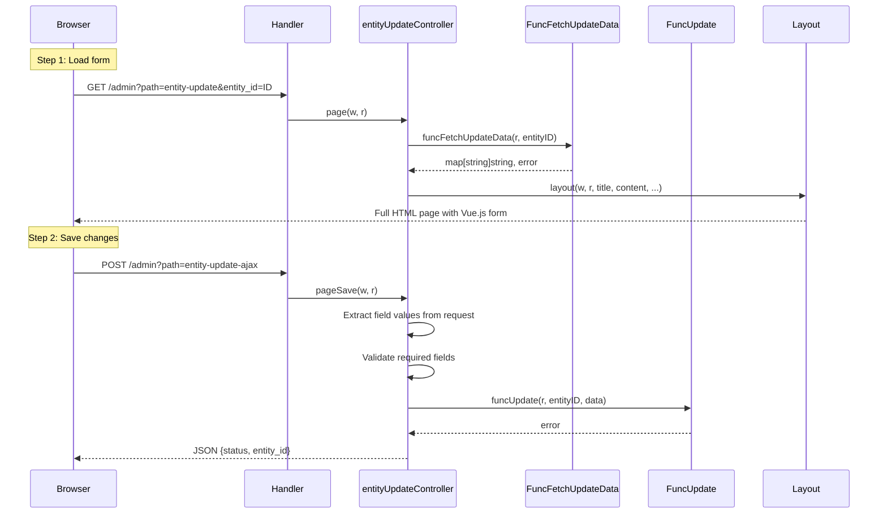
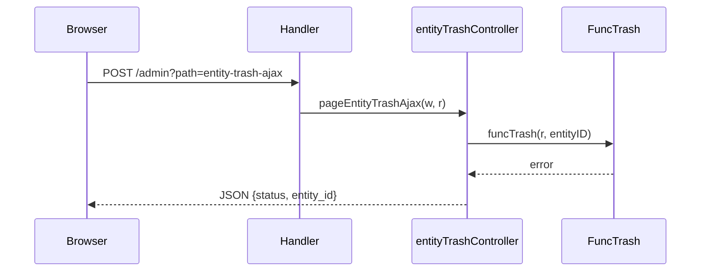
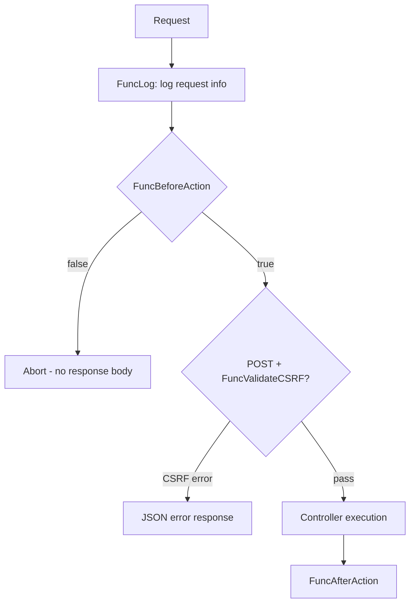

# Data Flow

## Overview

Data in the CRUD package flows through a well-defined pipeline: HTTP request → middleware → controller → callback functions → rendering → HTTP response. The package never accesses a database directly; all data operations are delegated to user-provided callback functions.

## Entity Manager (List) Flow

**Data transformations:**
1. `FuncRows` returns `[]Row` (each row has `ID` and `Data []string`)
2. `Data` values are mapped to table cells matching `ColumnNames`
3. Column names/values wrapped in `{!! !!}` are rendered as raw HTML
4. Vue.js app data is JSON-encoded via `json.Marshal` for XSS safety

## Entity Create Flow

**Data transformations:**
1. Form field names are extracted from `CreateFields` via `listCreateNames()`
2. Values are read from the POST body using `req.GetString(r, name)`
3. Required fields are validated (non-empty check)
4. `FuncCreate` receives `map[string]string` and returns the new entity ID
5. Response includes `redirect_url` (defaults to update page for the new entity)

## Entity Read Flow

**Data transformations:**
1. `entity_id` is extracted from query parameters
2. `FuncFetchReadData` returns `[]KeyValue` pairs
3. Keys and values wrapped in `{!! !!}` are rendered as raw HTML
4. Optional `FuncReadExtras` appends additional HTML elements below the card

## Entity Update Flow

**Data transformations:**
1. `FuncFetchUpdateData` returns `map[string]string` (field name → current value)
2. Values are JSON-encoded and injected into the Vue.js app as `customValues`
3. Vue.js binds values to form inputs via `v-model="entityModel.<fieldName>"`
4. On save, Vue.js sends all `entityModel` data via `$.post()`
5. Server extracts values using `listUpdateNames()` and `req.GetStringTrimmed()`

## Entity Trash Flow

**Data transformations:**
1. `entity_id` is extracted from the POST body
2. `FuncTrash` receives the entity ID and performs soft-deletion
3. On success, the browser reloads the page after a 3-second delay

## Middleware Data Flow

The `action` parameter passed to `FuncBeforeAction` and `FuncAfterAction` is the route path string (e.g., `"entity-manager"`, `"entity-create-ajax"`).

## See Also

- [Architecture](architecture.md) - System design and patterns
- [Modules: Controllers](modules/controllers.md) - Detailed controller documentation
- [Configuration](configuration.md) - Callback function signatures
- [API Reference](api_reference.md) - Complete API documentation
