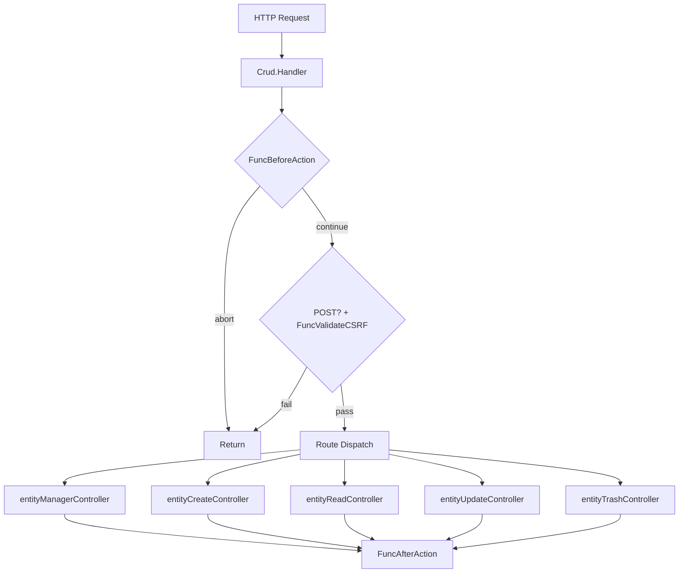

# Overview

## Introduction

The `github.com/dracory/crud/v2` package provides a complete, server-side rendered CRUD (Create, Read, Update, Trash) interface for Go web applications. It generates Bootstrap 5-based HTML pages with Vue.js 3 interactivity, allowing developers to quickly scaffold admin panels and entity management UIs.

The package follows a **callback-driven** design: you provide functions for data access (fetch rows, create, update, trash) and the package handles routing, HTML rendering, form generation, validation, and frontend interactivity.

## Key Features

- **Entity Manager** - Sortable DataTable listing with view, edit, and trash actions
- **Create Modal** - Bootstrap modal loaded via HTMX with form validation
- **Read View** - Read-only entity detail page with key-value pairs
- **Update Form** - Vue.js reactive form with two-way data binding
- **Trash** - Soft-delete with confirmation modal
- **Custom Layout** - Plug in your own layout function to wrap pages in your app shell
- **11 Field Types** - String, number, password, textarea, select, image, inline image, HTML editor, block editor, datetime picker, and raw HTML
- **Middleware Hooks** - `FuncBeforeAction` / `FuncAfterAction` for per-action authorization and audit logging
- **CSRF Validation** - Optional `FuncValidateCSRF` hook validates POST requests
- **Server-Side Pagination** - Configurable `PageSize` and `FuncRowsCount` for large datasets
- **Structured Logging** - Optional `FuncLog` callback for centralized logging
- **Unified JSON Responses** - All AJAX endpoints return consistent JSON via `api.Respond`

## Architecture Summary

The package follows a controller-based architecture where a single `Crud` struct acts as the central router and configuration holder. All routing is handled through a single `Handler` method that dispatches requests to internal controllers based on a `path` query parameter.

## Core Types

| Type | File | Description |
|------|------|-------------|
| `Crud` | `crud.go` | Central struct holding configuration, routing, layout, form rendering, URL helpers, and breadcrumbs |
| `Config` | `config.go` | Configuration struct passed to `New()` to create a `Crud` instance |
| `Row` | `row.go` | Represents a single row in the entity manager table |
| `KeyValue` | `key_value.go` | Key-value pair used by `FuncFetchReadData` for the read view |
| `Breadcrumb` | `breadcrumb.go` | Represents a breadcrumb navigation item |

## Controllers (internal)

| Controller | File | Responsibility |
|------------|------|----------------|
| `entityManagerController` | `entity_manager_controller.go` | Lists all entities in a DataTable with view/edit/trash actions |
| `entityCreateController` | `entity_create_controller.go` | Shows a Bootstrap modal for creating entities via HTMX; saves via AJAX |
| `entityReadController` | `entity_read_controller.go` | Displays entity details in a read-only table |
| `entityUpdateController` | `entity_update_controller.go` | Renders an edit form with Vue.js two-way binding; saves via AJAX |
| `entityTrashController` | `entity_trash_controller.go` | Handles soft-delete (trash) via AJAX POST |

## Frontend Stack

The default layout (when no custom `FuncLayout` is provided) includes the following CDN-loaded libraries:

- **Bootstrap 5.3.3** - CSS framework and JS components
- **jQuery 3.7.1** - DOM manipulation and AJAX
- **Vue.js 3** - Reactive UI for forms and entity management
- **Sweetalert2 11** - User-friendly alert dialogs
- **HTMX 2.0.0** - HTML-over-the-wire for modal loading
- **Element Plus 2.3.8** - Vue 3 date picker component
- **jQuery DataTables 1.13.4** - Sortable/searchable entity table
- **Trumbowyg 2.27.3** - WYSIWYG HTML editor for `htmlarea` fields
- **Vue Trumbowyg 4** - Vue 3 wrapper for Trumbowyg

## Dependencies

| Package | Purpose |
|---------|---------|
| `github.com/dracory/api` | JSON API response helpers (`api.Respond`, `api.Error`, `api.SuccessWithData`) |
| `github.com/dracory/bs` | Bootstrap component builder (modals, input groups) |
| `github.com/dracory/cdn` | CDN URL helpers for frontend libraries |
| `github.com/dracory/form` | Form field interface and builder |
| `github.com/dracory/hb` | HTML builder for server-side HTML generation |
| `github.com/dracory/req` | HTTP request parameter extraction |
| `github.com/dracory/str` | String utilities (random ID generation) |
| `github.com/samber/lo` | Functional programming helpers (map, ternary, forEach) |

## Security Model

- **XSS Prevention** - All user-controlled values interpolated into inline JavaScript are JSON-encoded via `json.Marshal`
- **HTTP Method Enforcement** - All state-mutating endpoints (create, update, trash) enforce `POST` method
- **Nil Safety** - All optional callback functions are checked for `nil` before invocation
- **CSRF Validation** - Optional `FuncValidateCSRF` hook validates POST requests before controller actions
- **Middleware Hooks** - `FuncBeforeAction` enables per-action authorization
- **Authentication** - Not handled directly; use `FuncBeforeAction` or wrap `Crud.Handler` with your own middleware

## Versions

| Version | Status | Import Path |
|---------|--------|-------------|
| v2 | **Current** (recommended) | `github.com/dracory/crud/v2` |
| v1 | Legacy (unmaintained) | `github.com/dracory/crud` |

## See Also

- [Getting Started](getting_started.md) - Installation and quick start
- [Architecture](architecture.md) - Detailed architecture and design patterns
- [API Reference](api_reference.md) - Complete API documentation
- [Configuration](configuration.md) - Config struct reference
